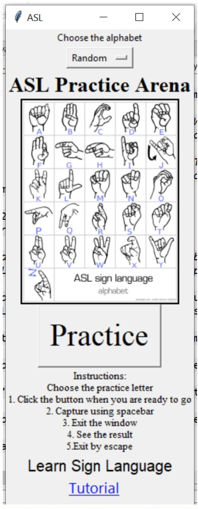
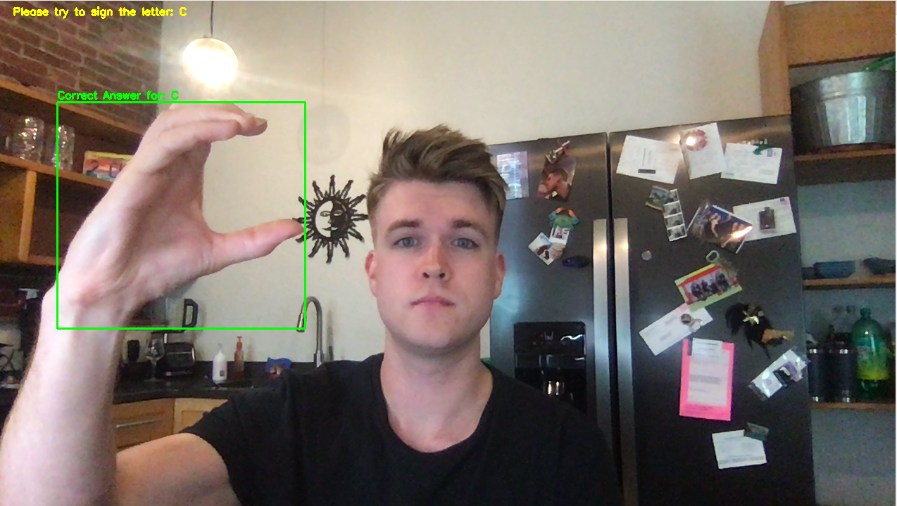
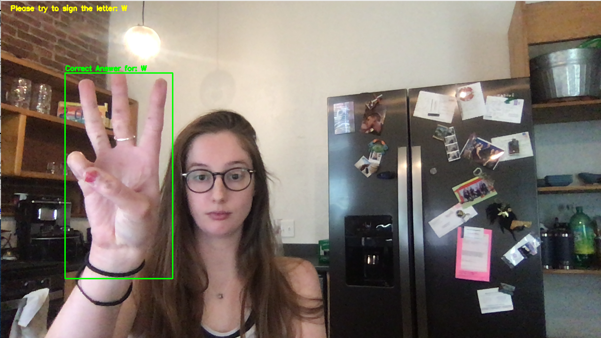
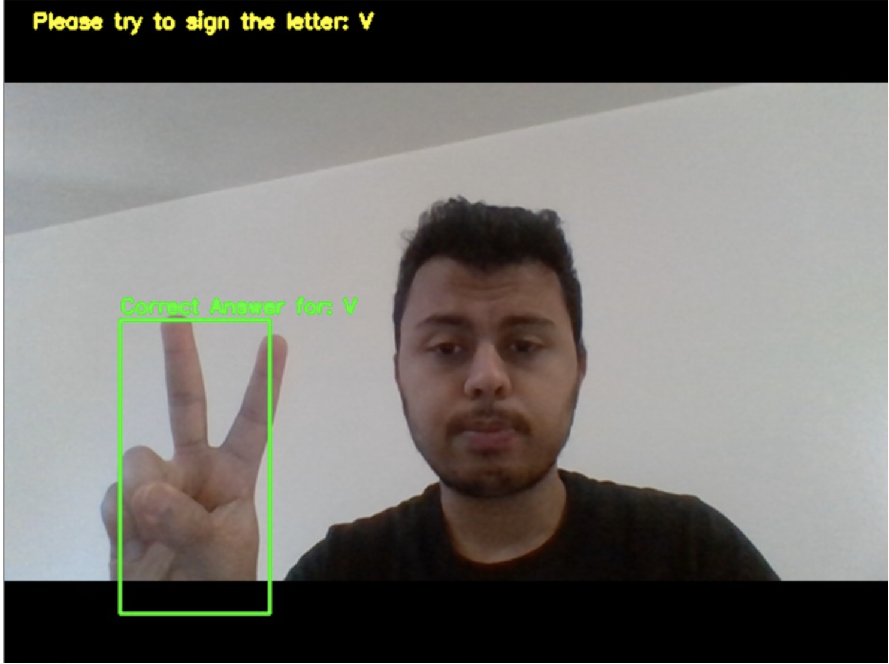
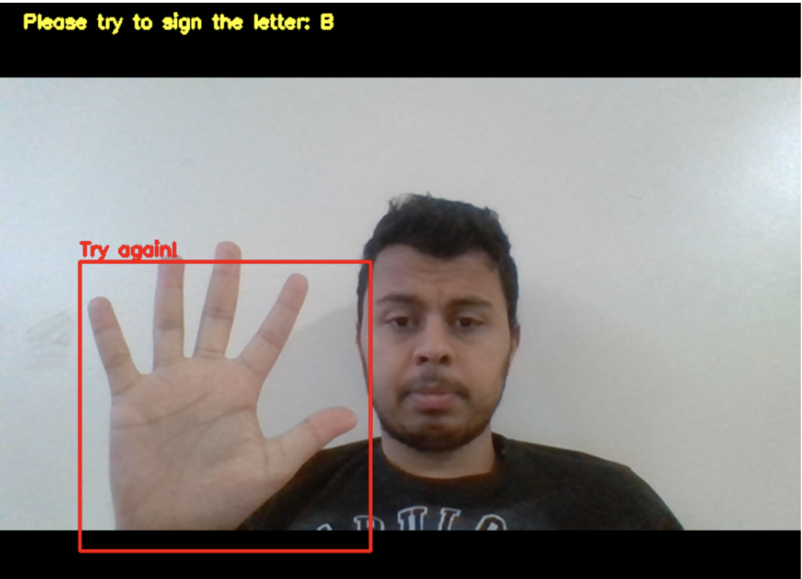

## ASL Active Learning GUI

This project was to make an interactive way to practice your alphabet in sign language.  Some images of the GUI and the results are shown below.  











### Using the GUI

First thing you need to do is change absolute paths in the botton_gui_V3.py script to the correct ones for your computer.  Next please see the folder "Models" in the "yolo-hand-detection" folder and download the "download_models.sh" file.  After that and after you have installed all of the dependencies you can use the GUI by typing the following code into your terminal.  

```python
python3 botton_gui_V3.py
```

### Implementation details

The YOLO object detection was pre-trained and can be found at "https://github.com/cansik/yolo-hand-detection".  Currently that is not working so a new hand detection model will need to be found and implemented into the code.  

A CNN was trained on a dataset obtained from Kaggle to predict what letter a hand was signing.  The YOLO hand detection was used to draw a box around the users hand so it could be cropped for the image analysis using the Tensorflow CNN model trained on the large Kaggle dataset.  

